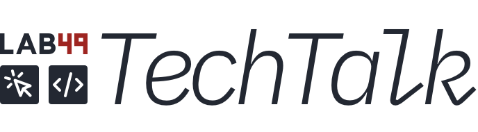

  

<h2 align=center>TechTalk Library</h2>

A collection of all of our TechTalk content, plus links to more.

 

# Past TechTalks

### [Next.js, Stepping Into the Future of UI Development](https://github.com/lab49/tech-talk-nextjs-future-of-ui-development)

#### Marth 5th, 2021
#### Presented by Carlin Canales

[ YouTube](https://youtu.be/F2JifPQVdkw)

 

### [Architectural Decision Record (ADR) Introduction](https://github.com/lab49/tech-talk-adr-introduction)

#### March 4th, 2021
#### Presented by Yi Hu

[ YouTube](https://youtu.be/t3JdHmUmXTY)

 

## [The Case for Building Client-First Web Apps](https://github.com/lab49/tech-talk-case-for-client-first-apps)

#### January 4th, 2021
#### Presented by Greg Magarshak

[ YouTube](https://youtu.be/yKPKuH6YCTc)

 

## [Creating icons for digital platforms](https://github.com/lab49/tech-talk-creating-icons-for-digital-platforms)

#### September 8th, 2020
#### Presented by Brian McAllister & James Cutts

[ YouTube](https://youtu.be/nRzPi7Vh_qI)

 

## [Creating, Using, and Maintaining a Design System](https://github.com/lab49/tech-talk-design-systems)

#### May 20th, 2020
#### Presented by Brian McAllister

[ YouTube](https://youtu.be/F2JifPQVdkw)

 

# Other content

## [OpenFin Webinar: Creating, Using, and Maintaining a Design System](https://github.com/lab49/openfin-webinar-creating-using-maintaining-design-systems)

#### February 17th, 2020
#### Presented by Brian McAllister

[ YouTube](https://www.youtube.com/watch?v=gQ8_PU_iGOU&t=1s)
